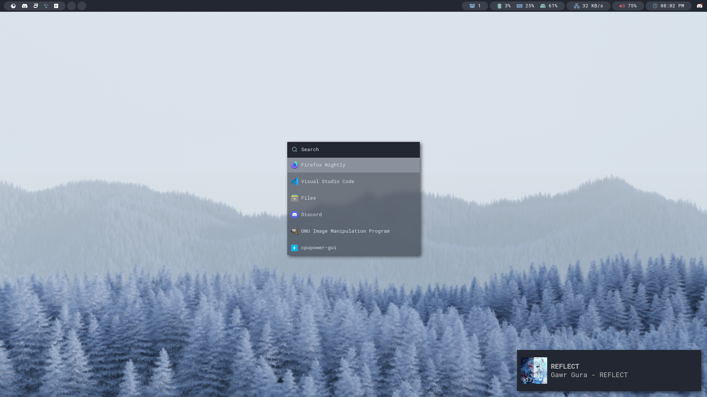

# Dotfiles

This repository contains my application configuration files, and some helper scripts.

Everything in this repository is for my **personal** use.

## Scripts

The [`install-pkgs.sh`](./install-pkgs.sh) script will install packages required for this config.

**Disclaimer:** The scripts will perform potentially destructive actions, so make sure you read
and them if you intend to use them.

## Screenshots

---

### License

All the included [wallpapers](./wall) are licensed under [`CC-BY-4.0`](./wall/LICENSE). Everything
else is licensed under [`GPL-3.0`](./LICENSE).
